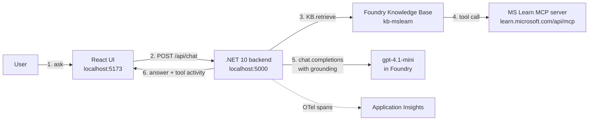

# Demo1 — MS Foundry MCP Chatbot

A localhost web chatbot that demonstrates Microsoft Foundry **Knowledge Bases** + **FoundryIQ**, grounding answers against the **MS Learn MCP server**. React UI + .NET 10 backend + .NET 10 infra tool, with a Foundry **Hosted Agent** as the optional deployment target.

> Acceptance: ask a question about a Microsoft API on `http://localhost:5173`. The backend retrieves grounded passages from a Knowledge Base whose source is the MS Learn MCP server, then chat-completes with the grounding, and renders the answer plus the MCP-derived references.

## Architecture



**Why backend-orchestrated?** The Azure SDK does not expose a strongly typed `KnowledgeBaseTool` for the Foundry agent in the SDK version we use. Orchestrating "KB then chat" in the backend (and again in the hosted agent project) gives the exact behavior the demo needs (KB → MCP → grounded answer), works with the current SDK, and produces the cleanest tool-activity payload for the UI.

## Layout

```
demo1/
  backend/        .NET 10 minimal API (chat + eval endpoints)
  frontend/       Vite + React + TS chat UI
  infra/          .NET 10 console tool (ensure-search, ensure-kb, ensure-agent)
  hosted-agent/   .NET 10 hosted-agent source (deployed via azd)
  tests/          xUnit test projects for backend and infra
  docs/           architecture.md, operations.md, testing.md
  state.json      Persisted resource IDs (gitignored)
```

## Prerequisites

- .NET SDK 10
- Node 20+
- Azure CLI, logged in to a subscription that has the Foundry account
- `azd` (only for Phase 9 deployment)
- A Foundry project — defaults point at `researchfoundry / researchProject` in subscription `02ae23db-54a4-424b-9ea3-e21903a9211e`. Edit [infra/Demo1.Infra/appsettings.json](infra/Demo1.Infra/appsettings.json) to point at your own.

## Quick start

```bash
# 1. provision Azure AI Search and connect it to the project (idempotent)
dotnet run --project infra/Demo1.Infra -- ensure-search

# 2. create the MCP-backed knowledge source and knowledge base
dotnet run --project infra/Demo1.Infra -- ensure-kb

# 3. smoke-test the KB retrieval path end-to-end
dotnet run --project infra/Demo1.Infra -- ensure-agent

# 3b. (optional) create a portal-visible Foundry hosted agent (MCP-tool)
dotnet run --project infra/Demo1.Infra -- ensure-hosted-agent

# 4. start backend (terminal A)
dotnet run --project backend/ChatbotApi

# 5. start frontend (terminal B)
cd frontend && npm install && npm run dev
# open http://localhost:5173
```

`ensure-all` runs steps 1, 2, 3, and 3b in sequence.

## Deploying to Azure Container Apps

One command builds both Docker images via ACR Tasks and deploys two container apps (backend + nginx-fronted SPA):

```bash
./deploy/deploy-aca.sh
```

Defaults: resource group `rg-demo1-aca`, region `westcentralus`, standard managed environment (Express preview does not yet support runtime managed identity). See [docs/operations.md](docs/operations.md#deploying-to-azure-container-apps) for the full breakdown, including the nginx SNI fix the frontend needs to talk to ACA's HTTPS ingress.

## Configuration

All defaults live in [infra/Demo1.Infra/appsettings.json](infra/Demo1.Infra/appsettings.json) and are persisted to `state.json` after provisioning. The backend reads the same values from `appsettings.json` and these optional environment variables:

| Variable | Purpose | Default |
| --- | --- | --- |
| `FOUNDRY_PROJECT_ENDPOINT` | Foundry project endpoint | from appsettings |
| `FOUNDRY_MODEL_NAME` | Chat-completion deployment name | `gpt-4.1-mini` |
| `KNOWLEDGE_BASE_NAME` | KB to query | `kb-mslearn` |
| `SEARCH_ENDPOINT` | AI Search endpoint hosting the KB | from `state.json` |
| `MCP_SERVER_URL` | MCP server URL (info only; KB is the caller) | `https://learn.microsoft.com/api/mcp` |
| `APPLICATIONINSIGHTS_CONNECTION_STRING` | Override AI auto-discovery | resolved from project |
| `HOSTED_AGENT_NAME` | Switch chat to a deployed Hosted Agent | unset (in-process) |

## Tests

```bash
dotnet test                    # backend + infra unit tests
cd frontend && npm test        # React component tests (Vitest)
```

See [docs/testing.md](docs/testing.md) for the test matrix.

## Docs

- [docs/architecture.md](docs/architecture.md) — components, sequence diagram, design rationale
- [docs/operations.md](docs/operations.md) — running, re-provisioning, App Insights KQL, hosted-agent deploy
- [docs/testing.md](docs/testing.md) — test layout and how to add cases

## Troubleshooting

- `403 Forbidden` from Search: re-run `ensure-search` — it grants the current user `Search Service Contributor` + `Search Index Data Contributor`, and grants the same to the Foundry account managed identity.
- `400 KnowledgeSourceNotFound`: run `ensure-kb` again; the KB references a knowledge source by name.
- Empty answers from the UI: check the App Insights trace for the request id printed in the response panel; look for failed MCP calls.
