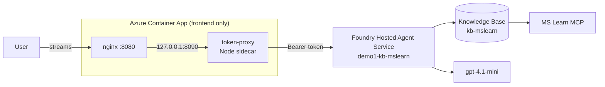

# Demo1 — Foundry Hosted Agent + MS Learn Knowledge Base

A streaming chatbot demo built on a **Microsoft Foundry hosted agent** that grounds every answer in the **MS Learn MCP server** via a Foundry **Knowledge Base**. The agent runs in **Foundry's Hosted Agent Service**; a React SPA + Node token-proxy sidecar are the only things deployed to Azure Container Apps. The browser streams Server-Sent Events end-to-end, with live tool pills and per-turn token-usage + cost.

> Acceptance: ask a question on the deployed `chatbot-web` site. The agent calls `knowledge_base_search`, the KB queries the MS Learn MCP server, the model writes an answer with `[n]` citations, and the UI shows tokens-in / tokens-out / estimated cost the moment the stream completes.

## Architecture



There is **no backend API**, and the agent does **not** run in the Container App — it lives in Foundry's Hosted Agent Service, where it owns the system prompt, the `knowledge_base_search` function tool, and the streaming Responses endpoint. The Container App holds only the SPA and a token-proxy sidecar that attaches a workload-identity bearer so the browser never sees credentials.

See [docs/architecture.md](docs/architecture.md) for the full picture, including the streaming-event contract and the KB endpoint pitfall that caused the historical 401.

## Layout

```
demo1/
  hosted-agent/    .NET 10 Foundry hosted agent (Demo1.Agent) — deployed to Foundry Agent Service
    Program.cs       AgentHost + Foundry Responses + function tool
    Tools/           KnowledgeBaseSearchTool + KbCitationParser
    Instructions.cs  System prompt (call KB first, cite every fact)
    Dockerfile       aspnet:10.0 multi-stage
    agent.manifest.yaml   Hosted-agent manifest consumed by `azd ai agent init`
  frontend/
    src/             React SPA (streaming chat, tool pills, usage footer)
    src/streaming/   SSE parser
    src/api/         streamChat() async iterator
    src/pricing.ts   List-price table + estimateCost()
    src/test/        Vitest cases (17 passing)
    proxy/           Node token-proxy sidecar (server.mjs + Dockerfile)
    Dockerfile       nginx + Vite bundle
    nginx.conf.template  /api/responses → 127.0.0.1:8090 (buffering off)
  infra/Demo1.Infra/  .NET 10 console: ensure-search / ensure-kb / ensure-agent
  deploy/
    deploy-agent.sh   azd: build + register the hosted agent in Foundry Agent Service
    deploy-aca.sh     az acr build + multi-container ACA deploy (frontend only)
  docs/               architecture.md, operations.md, testing.md
  state.json          Persisted resource IDs (gitignored)
```

## Prerequisites

- .NET SDK 10
- Node 20+
- Azure CLI 2.86+ with the `containerapp` extension
- `az login` against a subscription that has the Foundry account
- A Foundry project — defaults point at `researchfoundry / researchProject`. Edit [infra/Demo1.Infra/appsettings.json](infra/Demo1.Infra/appsettings.json) to point at your own.

## Quick start

```bash
# 1. provision Azure AI Search and connect it to the project (idempotent)
dotnet run --project infra/Demo1.Infra -- ensure-search

# 2. create the MCP-backed knowledge source and knowledge base
dotnet run --project infra/Demo1.Infra -- ensure-kb

# 3. smoke-test the KB retrieval path end-to-end
dotnet run --project infra/Demo1.Infra -- ensure-agent

# 4. run the hosted agent locally (port 8088)
cd hosted-agent
cp .env.example .env && $EDITOR .env
dotnet run

# 5. run the token-proxy sidecar (port 8090, no Entra token for local agent)
cd frontend/proxy && npm install
FOUNDRY_AGENT_ENDPOINT=http://127.0.0.1:8088 FOUNDRY_TOKEN_SCOPE= INJECT_ISOLATION_KEYS=true node server.mjs

# 6. start the SPA
cd frontend && npm install && npm run dev
# open http://localhost:5173
```

## Deploying

Deployment has **two halves** — the agent goes to Foundry's Hosted Agent Service, the frontend goes to Azure Container Apps:

```bash
# 1. build + register the hosted agent in Foundry Agent Service (azd ai agent)
azd extension install azure.ai.agents      # one-time
./deploy/deploy-agent.sh

# 2. deploy the frontend Container App, pointing the sidecar at the agent
FOUNDRY_AGENT_RESPONSES_URL="<the URL printed by step 1>" ./deploy/deploy-aca.sh
```

`deploy-agent.sh` drives `azd ai agent init/provision/deploy` so the agent appears under *Foundry → project → Agents* (Type `hosted`). `deploy-aca.sh` builds two images (`chatbot-web` + `token-proxy`), deploys a single multi-container Container App (frontend only), and grants its identity **Azure AI User** at the project scope so the sidecar can invoke the agent. See [docs/operations.md](docs/operations.md#deploying) for the full breakdown.

## Tests

```bash
dotnet build hosted-agent/Demo1.Agent.csproj          # agent compiles
dotnet build infra/Demo1.Infra/Demo1.Infra.csproj     # infra compiles
cd frontend && npm test                               # 17 Vitest cases
cd frontend && npm run build                          # tsc + Vite bundle
```

See [docs/testing.md](docs/testing.md) for the test matrix.

## Evaluating answer quality

[eval/](eval) scores the deployed assistant with Azure AI Foundry's built-in
**Groundedness**, **Relevance**, and **Retrieval** evaluators and logs each run
to the Foundry portal's *Evaluations* tab:

```bash
cd eval
python3 -m venv .venv && . .venv/bin/activate
pip install -r requirements.txt
cp .env.example .env
python run_eval.py --limit 3   # quick smoke test; prints a studio_url
```

See [docs/operations.md](docs/operations.md#evaluating-answer-quality) for the full guide.

## Docs

- [docs/architecture.md](docs/architecture.md) — components, sequence diagram, streaming contract, design rationale
- [docs/operations.md](docs/operations.md) — running locally, deploying the agent + frontend, App Insights KQL, troubleshooting matrix
- [docs/testing.md](docs/testing.md) — test layout and how to add a model

## Troubleshooting

The most common issues — `KB 0 references`, `HostedSessionIsolationKeyProvider returned null`, RBAC propagation lag, SSE buffering — are covered in the *Troubleshooting matrix* in [docs/operations.md](docs/operations.md#troubleshooting-matrix).
