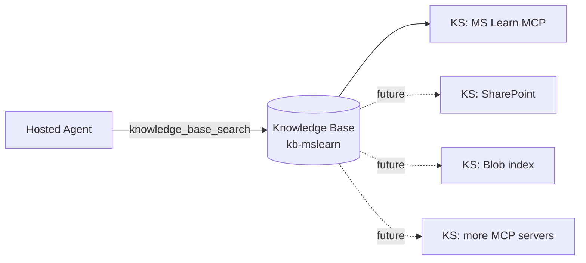
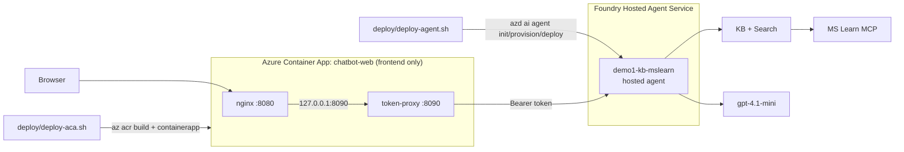
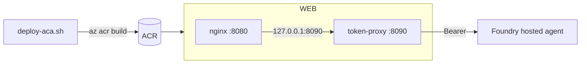

# Architecture

## Components

| Component | Tech | Responsibility |
| --- | --- | --- |
| `frontend/` (nginx + Vite SPA) | React 19 + TypeScript + Vite | Streaming chat UI: tool pills, citation list, per-turn token usage + cost. **The only thing deployed to Azure Container Apps.** |
| `frontend/proxy/` (sidecar) | Node 24, `@azure/identity` | Mints a workload-identity bearer token and streams the SSE response through to the Foundry hosted agent's Responses endpoint |
| `hosted-agent/` | .NET 10 + `Microsoft.Agents.AI.Foundry.Hosting` + `Azure.AI.Projects` | The agent image. Deployed **into Foundry's Hosted Agent Service** (not ACA). Exposes the OpenAI Responses API (SSE). Owns the system prompt and the `knowledge_base_search` function tool |
| Foundry Hosted Agent Service | Microsoft-managed | Runs the agent container, manages sessions, fronts it with the project Responses endpoint, and lists it under *project → Agents* |
| `infra/Demo1.Infra` | .NET 10 console | Idempotent provisioning of Search + Knowledge Base + a smoke test |
| Azure AI Search | Provisioned by `ensure-search` | Hosts the `kb-mslearn` Knowledge Base + Knowledge Source(s) |
| MS Learn MCP server | Hosted by Microsoft | The Knowledge Base's current grounding source |
| Application Insights | Provisioned with the agent | Receives OTel spans (Foundry injects the connection string into the agent container) |

There is **no backend API**, and the agent does **not** run in our Container App. The browser streams from the Foundry-hosted agent through a thin token-attaching proxy that runs alongside nginx in the frontend Container App.

## Request sequence

```mermaid
sequenceDiagram
    autonumber
    participant U   as User
    participant UI  as React SPA
    participant NGX as nginx (frontend container)
    participant PRX as token-proxy (sidecar)
    participant AG  as Foundry Hosted Agent Service<br/>(demo1-kb-mslearn)
    participant KB  as Knowledge Base (kb-mslearn)
    participant MCP as MS Learn MCP

    U->>UI:  types question
    UI->>NGX: POST /api/responses {input, stream:true}
    NGX->>PRX: proxy_pass http://127.0.0.1:8090 (no buffering)
    PRX->>PRX: DefaultAzureCredential.getToken(https://ai.azure.com/.default)
    PRX->>AG: POST .../agents/demo1-kb-mslearn/endpoint/protocols/openai/responses<br/>Authorization: Bearer …
    AG-->>PRX: SSE: response.created
    AG->>AG: model picks tool: knowledge_base_search({query})
    AG-->>PRX: SSE: response.output_item.added (function_call)
    AG-->>PRX: SSE: response.function_call_arguments.delta × N / .done
    AG->>KB: KnowledgeBaseRetrievalClient.Retrieve(query)
    KB->>MCP: tools/call microsoft_docs_search
    MCP-->>KB: passages + URLs + titles
    KB-->>AG: KnowledgeBaseRetrievalResponse
    AG-->>PRX: SSE: response.output_item.done (function_call_output)
    AG-->>PRX: SSE: response.output_text.delta × N
    AG-->>PRX: SSE: response.completed { usage: { input_tokens, output_tokens, total_tokens } }
    PRX-->>NGX: streamed (passthrough)
    NGX-->>UI: streamed (passthrough)
    UI-->>U: deltas render live; tool pill turns ✓; usage + cost shown on completed
```

## Design rationale

### Why a Foundry hosted agent, not a backend API?

Previously a .NET backend called `Azure.AI.Agents.Persistent` to run an Assistants-style agent. That agent appeared under *Foundry → classic agents*, not the new Agents view, because the OpenAI Assistants object model is a separate surface from Foundry's new hosted-agent runtime.

The current architecture moves the *entire* orchestration into the agent process itself and then ships that process **into Foundry's Hosted Agent Service**:

- `Microsoft.Agents.AI.Foundry.Hosting` (`AgentHost.CreateBuilder` + `AddFoundryResponses` + `MapFoundryResponses`) exposes the OpenAI Responses API — the same protocol the new Foundry portal speaks.
- `AIProjectClient.AsAIAgent(model, instructions, name, description, tools)` wires a single `AIFunctionFactory.Create(KnowledgeBaseSearchTool.SearchAsync, "knowledge_base_search")` function tool. The model decides when to call it; the runtime executes it in-process; the tool output is folded back into the same response stream.
- The container is registered as a **Hosted agent version** via `azd ai agent` (see *Deploying the agent* below). Foundry runs the container, manages sessions, and exposes it at a project Responses endpoint. The agent shows up under *project → Agents* with Type `hosted`.
- The browser talks **streaming SSE** end-to-end, so tool calls, function-argument deltas, and text deltas all surface in the UI as they happen.

The Container App has no agent responsibilities at all — it serves the SPA and proxies one route.

### Why a token-proxy sidecar?

Browsers cannot mint Microsoft Entra tokens, and the Foundry hosted-agent endpoint *requires* an Entra bearer token — so a token-attaching hop is mandatory, not optional. The ~130-LOC Node sidecar in [frontend/proxy/server.mjs](../frontend/proxy/server.mjs):

1. Runs as a second container in the same ACA app as nginx (so they share `127.0.0.1` and a single managed identity).
2. Acquires a token via `DefaultAzureCredential` for `FOUNDRY_TOKEN_SCOPE` (default `https://ai.azure.com/.default`, cached until 5 minutes before expiry).
3. Forwards each request to `FOUNDRY_AGENT_RESPONSES_URL` — the Foundry project's per-agent Responses endpoint — with the `Authorization: Bearer …` header attached.
4. Pipes the response body straight back, preserving `text/event-stream` semantics (sets `x-accel-buffering: no` and `cache-control: no-cache, no-transform`).

The Foundry Agent Service manages conversation sessions itself, so the sidecar does **not** send per-session isolation keys in production. For a locally-run agent container (whose in-memory session provider needs them), set `INJECT_ISOLATION_KEYS=true` and the sidecar derives `x-agent-user-isolation-key` / `x-agent-chat-isolation-key` from `x-session-id` or the client's IP.

For local development against an agent you run yourself, set `FOUNDRY_AGENT_ENDPOINT=http://127.0.0.1:8088` (the sidecar appends `/responses`) and `FOUNDRY_TOKEN_SCOPE=` (empty) to skip token acquisition.

### Knowledge base shape



The KB is a long-lived integration layer. It currently holds one knowledge source (`ks-mslearn-mcp`), but the agent always asks one tool (`knowledge_base_search`); the KB fans out to whichever sources it owns. Adding a new source does not change the agent.

### KB endpoint pitfall (root cause of the historical 401)

The KB's `AzureOpenAIVectorizerParameters.ResourceUri` **must** be the OpenAI host (`https://<account>.openai.azure.com/`), not `https://<account>.cognitiveservices.azure.com/`. With `disableLocalAuth=true` on the Foundry account, the cognitive-services host returns 401 because the bearer audience does not match. `EnsureKnowledgeBaseCommand` writes the correct host.

### Citation extraction shape

`KnowledgeBaseRetrievalResponse.Response[0].Content[0].Text` is a JSON array `[{ ref_id, title, content, contentUrl }, …]`, where each `content` is itself a JSON string. [hosted-agent/Tools/KbCitationParser.cs](hosted-agent/Tools/KbCitationParser.cs) walks both layers and produces `KbCitation { Title, Url, Snippet }` records. The agent's `KnowledgeBaseSearchTool.SearchAsync` returns this as a stable JSON shape `[{index, title, url, snippet}]` so the model and the frontend agree.

### Streaming event contract

The frontend SSE consumer ([frontend/src/api/streamChat.ts](frontend/src/api/streamChat.ts)) translates Foundry Responses events into a typed `StreamEvent` discriminated union:

| Source event | UI effect |
| --- | --- |
| `response.created` | reserved (response id) |
| `response.output_item.added` (`function_call`) | shows tool pill with name |
| `response.function_call_arguments.delta` | appends to the tool pill's arg preview |
| `response.output_item.done` (`function_call_output`) | marks pill ✓, parses tool output as citations |
| `response.output_text.delta` | appends to the answer text |
| `response.completed` | renders the usage footer (`input_tokens`, `output_tokens`, model, latency, cost) |

`UsageFooter` calls `estimateCost(model, usage)` against the table in [frontend/src/pricing.ts](frontend/src/pricing.ts). Rates are USD list prices per 1M tokens; the comment in that file pins the verification date and source URL.

### Telemetry

When the agent runs in Foundry's Hosted Agent Service, the platform automatically injects `APPLICATIONINSIGHTS_CONNECTION_STRING` into the agent container and the Foundry Responses runtime emits GenAI spans (model, prompt/completion tokens, tool calls). For a locally-run container, `hosted-agent/Program.cs` only wires Azure Monitor when that variable is set.

### Deploying: two halves

The agent and the frontend deploy to **two different places** and are driven by two scripts.



#### 1. Deploying the agent (Foundry Hosted Agent Service)

[deploy/deploy-agent.sh](../deploy/deploy-agent.sh) drives the `azd ai agent` extension:

```bash
azd ai agent init -m hosted-agent/agent.manifest.yaml --agent-name demo1-kb-mslearn --src hosted-agent
azd provision        # ACR, App Insights, Log Analytics, project wiring
azd deploy           # builds the image, registers a Hosted agent version, waits for active
```

`azd deploy` prints the agent's playground link and its Responses endpoint:
`https://<account>.services.ai.azure.com/api/projects/<project>/agents/demo1-kb-mslearn/endpoint/protocols/openai/responses`.

azd assigns the baseline RBAC automatically (Container Registry Repository Reader for the project managed identity; **Foundry User** for the platform-created agent identity, so it can call the model). The agent identity additionally needs Azure AI **Search** access because `knowledge_base_search` calls Search directly — the script grants `Search Index Data Reader` + `Search Service Contributor` to the agent identity.

#### 2. Deploying the frontend (Azure Container Apps)



[deploy/deploy-aca.sh](../deploy/deploy-aca.sh) builds **two** images (`chatbot-web` nginx + `token-proxy`) and deploys a single multi-container Container App. Key decisions:

- **Standard env, not Express.** ACA Express preview lists *Managed identity (app runtime)* as *In development*; the sidecar needs a system-assigned identity to mint the Entra token.
- **Multi-container `chatbot-web`.** nginx + the sidecar share the network namespace, so the proxy is `http://127.0.0.1:8090` to nginx — no service discovery needed.
- **`az acr build` + YAML `containerapp` apply.** The multi-container spec (including `identity: SystemAssigned`) is rendered as YAML and applied with `az containerapp create/update --yaml`.
- **RBAC.** The frontend SAMI gets **Azure AI User** (Foundry User) at the **project** scope — the data-plane role required to invoke a hosted agent. That is the *only* role the frontend needs; it never talks to Search, the model, or the KB directly.
