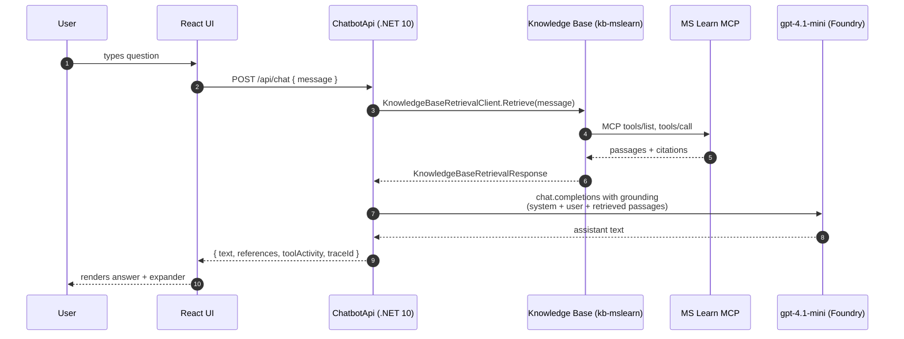
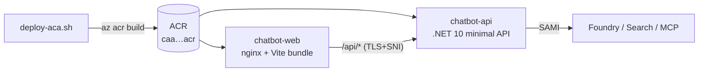

# Architecture

## Components

| Component | Tech | Responsibility |
| --- | --- | --- |
| `frontend/` | Vite + React + TypeScript + Fluent UI | Chat UI, eval panel, tool-activity expander |
| `backend/ChatbotApi` | .NET 10 minimal API | `/api/chat`, `/api/health`, `/api/eval/run`; OTel → App Insights |
| `infra/Demo1.Infra` | .NET 10 console | Idempotent provisioning of Search + KB; never deploys app code |
| `hosted-agent/HostedAgent` | .NET 10 hosted agent | Same orchestration as backend service, packaged for `azd deploy` |
| Azure AI Search | Provisioned by `ensure-search` | Hosts the Knowledge Base + Knowledge Source |
| MS Learn MCP server | Hosted by Microsoft (public) | The actual source of grounding |
| Application Insights | Existing on the project | Receives OTel spans |

## Request sequence (chat)

## Design rationale

### Why orchestrate KB + chat in the backend (not a declarative agent)?

The shipping Azure SDK (`Azure.AI.Projects.Agents` 2.1.0-beta.3) does not yet expose a strongly typed `KnowledgeBaseTool` that we can attach to a `DeclarativeAgentDefinition`. We could hand-roll the tool JSON via `BinaryData`, but the resulting agent is harder to evaluate (no clean tool-call surface for the eval panel) and harder to test (cannot mock the agent's internal tool dispatch). Backend orchestration:

1. Gives the demo the verbatim flow the user asked for: *chatbot calls the KB which calls MCP*.
2. Is fully unit-testable — both steps have public mockable clients.
3. Produces a predictable `toolActivity` payload for the UI.
4. Ports trivially to the Hosted Agent: the same `IChatService.AnswerAsync` runs in either process.

### Knowledge base shape

- One `McpServerKnowledgeSource` named `ks-mslearn-mcp` → `https://learn.microsoft.com/api/mcp`, no auth (public).
- One `KnowledgeBase` named `kb-mslearn` with the source above and one `KnowledgeBaseAzureOpenAIModel` pointing at the project's `gpt-4.1-mini` deployment (used by the KB for query planning).

### Telemetry

`AppContext.SetSwitch("Azure.Experimental.EnableGenAITracing", true)` + `Azure.Experimental.TraceGenAIMessageContent=true` are set before host build. `AddOpenTelemetry().UseAzureMonitor(...)` wires the Azure SDK sources, and the chat endpoint adds an `Activity` for the orchestration so the trace shows: `POST /api/chat → KB.Retrieve → chat.completion`.

### Hosted Agent (Phase 9)

The same orchestration lives in `hosted-agent/HostedAgent/Program.cs`, packaged as a Foundry Hosted Agent and pushed with `azd deploy`. The backend can switch to the hosted agent by setting `HOSTED_AGENT_NAME` and calling the project's Responses API instead of orchestrating locally.

### Foundry Hosted Agent (MCP-tool, portal-visible)

In addition to the backend orchestrator and the azd-deployed hosted-agent project, `ensure-hosted-agent` creates a **persistent Foundry agent** that lives inside the project itself and shows up in the portal under *project → Agents*. It is defined with one `MCPToolDefinition` pointing at the MS Learn MCP server (`https://learn.microsoft.com/api/mcp`), uses the same `gpt-4.1-mini` deployment, and is provisioned with `Azure.AI.Agents.Persistent` 1.2.0-beta.8.

Why a second hosted form? The persistent agent gives operators a portal surface to inspect, version, and invoke the assistant via the standard Foundry Agents/Assistants API — without re-deploying a container. It bypasses the Knowledge Base path entirely (calling MCP directly through the agent's tool runtime), which avoids the sticky-cache 401 we sometimes see on freshly-granted Search managed identities. The agent id is persisted to `state.json` as `hostedAgentId`.

### Deploying to Azure Container Apps

`deploy/deploy-aca.sh` is a one-command deploy that stands the same two processes up in Azure Container Apps:

Key decisions:

- **Standard env, not Express.** ACA Express preview lists *Managed identity (app runtime)* as *In development*; the backend needs a system-assigned MI to call Foundry and Search, so we deploy into a standard managed environment. The script supports `ENV_MODE=express` for the future but defaults to `standard`.
- **`az acr build` + `az containerapp create/update` instead of `az containerapp up`.** The `containerapp` CLI extension currently raises `'NoneType' object has no attribute 'linux'` on `up --source` (regression in 1.3.0b4); the explicit build+create path sidesteps it.
- **Two apps, one ingress each.** The frontend has external ingress; it proxies `/api/*` to the backend's external ingress over HTTPS. We considered internal ingress for the backend but kept it external so the demo can `curl` either endpoint.
- **nginx → HTTPS upstream needs SNI.** ACA's ingress (fronted by Azure Front Door) **requires SNI** on the TLS handshake. nginx, by default, sends the upstream IP as the SNI and Host, which gets the handshake reset. The frontend's [frontend/nginx.conf.template](frontend/nginx.conf.template) sets `proxy_ssl_server_name on`, `proxy_ssl_name $backend_host`, and `Host $backend_host`, where `$backend_host` is supplied as the `BACKEND_HOST` env var (just the FQDN, no scheme). `BACKEND_URL` is the full scheme+FQDN used in `proxy_pass`. Both are substituted at container start by nginx's stock envsubst entrypoint (`/docker-entrypoint.d/20-envsubst-on-templates.sh`).
- **RBAC.** The script assigns `Cognitive Services OpenAI User` on the Foundry account and `Search Index Data Reader` on the Search service to the backend's SAMI. Propagation can take several minutes — the first `POST /api/chat` may 401; subsequent calls succeed.
