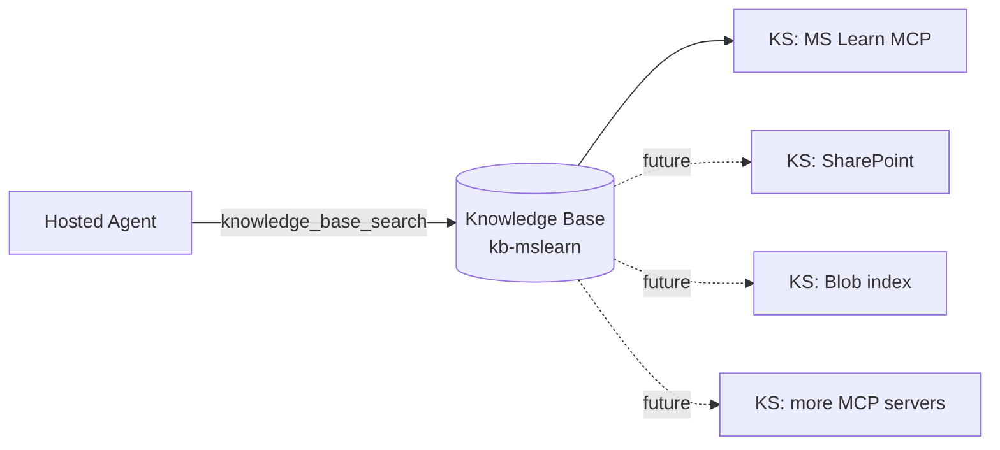
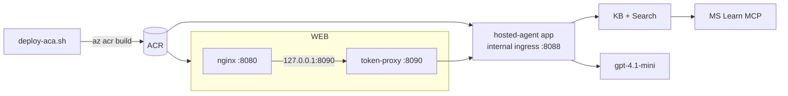

# Architecture

## Components

| Component | Tech | Responsibility |
| --- | --- | --- |
| `frontend/` (nginx + Vite SPA) | React 19 + TypeScript + Vite | Streaming chat UI: tool pills, citation list, per-turn token usage + cost |
| `frontend/proxy/` (sidecar) | Node 24, `@azure/identity` | Adds the workload-identity bearer token (or none, for ACA-internal) and streams the SSE response through |
| `hosted-agent/` | .NET 10 + `Microsoft.Agents.AI.Foundry.Hosting` + `Azure.AI.Projects` | The Foundry hosted agent. Exposes `/responses` (OpenAI Responses API, SSE). Owns the system prompt and the `knowledge_base_search` function tool |
| `infra/Demo1.Infra` | .NET 10 console | Idempotent provisioning of Search + Knowledge Base + a smoke test |
| Azure AI Search | Provisioned by `ensure-search` | Hosts the `kb-mslearn` Knowledge Base + Knowledge Source(s) |
| MS Learn MCP server | Hosted by Microsoft | The Knowledge Base's current grounding source |
| Application Insights | Optional | Receives OTel spans (agent-side) when `APPLICATIONINSIGHTS_CONNECTION_STRING` is set |

There is **no backend API**. The browser streams directly from the hosted agent through a thin token-attaching proxy in the same Container App.

## Request sequence

```mermaid
sequenceDiagram
    autonumber
    participant U   as User
    participant UI  as React SPA
    participant NGX as nginx (frontend container)
    participant PRX as token-proxy (sidecar)
    participant AG  as Hosted Agent (Demo1.Agent)
    participant KB  as Knowledge Base (kb-mslearn)
    participant MCP as MS Learn MCP

    U->>UI:  types question
    UI->>NGX: POST /api/responses {input, stream:true}
    NGX->>PRX: proxy_pass http://127.0.0.1:8090 (no buffering)
    PRX->>AG: POST /responses + Authorization: Bearer (when scope set)
    AG-->>PRX: SSE: response.created
    AG->>AG: model picks tool: knowledge_base_search({query})
    AG->>KB: KnowledgeBaseRetrievalClient.Retrieve(query)
    KB->>MCP: tools/call microsoft_docs_search
    MCP-->>KB: passages + URLs + titles
    KB-->>AG: KnowledgeBaseRetrievalResponse
    AG-->>PRX: SSE: response.function_call_arguments.delta/.done<br/>SSE: response.output_item.done (function_call_output)
    AG-->>PRX: SSE: response.output_text.delta × N
    AG-->>PRX: SSE: response.completed { usage: { input_tokens, output_tokens, total_tokens } }
    PRX-->>NGX: streamed (passthrough)
    NGX-->>UI: streamed (passthrough)
    UI-->>U: deltas render live; tool pill turns ✓; usage + cost shown on completed
```

## Design rationale

### Why a Foundry hosted agent, not a backend API?

Previously a .NET backend called `Azure.AI.Agents.Persistent` to run an Assistants-style agent. That agent appeared under *Foundry → classic agents*, not the new Agents view, because the OpenAI Assistants object model is a separate surface from Foundry's new hosted-agent runtime.

The current architecture moves the *entire* orchestration into the agent process itself:

- `Microsoft.Agents.AI.Foundry.Hosting` (`AgentHost.CreateBuilder` + `AddFoundryResponses` + `MapFoundryResponses`) exposes the OpenAI Responses API (`/responses`) — the same protocol the new Foundry portal speaks.
- `AIProjectClient.AsAIAgent(model, instructions, name, description, tools)` wires a single `AIFunctionFactory.Create(KnowledgeBaseSearchTool.SearchAsync, "knowledge_base_search")` function tool. The model decides when to call it; the runtime executes it in-process; the tool output is folded back into the same response stream.
- The browser talks **streaming SSE** end-to-end, so tool calls, function-argument deltas, and text deltas all surface in the UI as they happen.

The hosted agent has no other responsibilities. There is no separate web tier to operate.

### Why a token-proxy sidecar?

Browsers cannot mint Microsoft Entra tokens, and shipping a SAMI's credentials to a SPA is unacceptable. The 120-LOC Node sidecar in `frontend/proxy/server.mjs`:

1. Runs as a second container in the same ACA app as nginx (so they share `127.0.0.1` and a single managed identity).
2. Acquires a token via `DefaultAzureCredential` for the configured `FOUNDRY_TOKEN_SCOPE` (cached until 5 minutes before expiry).
3. Forwards each request to `${FOUNDRY_AGENT_ENDPOINT}/responses` with the `Authorization: Bearer …` header attached.
4. Pipes the response body straight back, preserving `text/event-stream` semantics (sets `x-accel-buffering: no` and `cache-control: no-cache, no-transform`).
5. Derives per-session isolation keys (`x-agent-user-isolation-key`, `x-agent-chat-isolation-key`) from `x-session-id` or the client's IP. These keys partition the agent's in-memory conversation store so concurrent sessions don't leak into one another.

When deploying the agent to an ACA-internal endpoint (no Entra in front), set `FOUNDRY_TOKEN_SCOPE=` (empty) — the sidecar skips token acquisition and just forwards.

### Knowledge base shape



The KB is a long-lived integration layer. It currently holds one knowledge source (`ks-mslearn-mcp`), but the agent always asks one tool (`knowledge_base_search`); the KB fans out to whichever sources it owns. Adding a new source does not change the agent.

### KB endpoint pitfall (root cause of the historical 401)

The KB's `AzureOpenAIVectorizerParameters.ResourceUri` **must** be the OpenAI host (`https://<account>.openai.azure.com/`), not `https://<account>.cognitiveservices.azure.com/`. With `disableLocalAuth=true` on the Foundry account, the cognitive-services host returns 401 because the bearer audience does not match. `EnsureKnowledgeBaseCommand` writes the correct host.

### Citation extraction shape

`KnowledgeBaseRetrievalResponse.Response[0].Content[0].Text` is a JSON array `[{ ref_id, title, content, contentUrl }, …]`, where each `content` is itself a JSON string. [hosted-agent/Tools/KbCitationParser.cs](hosted-agent/Tools/KbCitationParser.cs) walks both layers and produces `KbCitation { Title, Url, Snippet }` records. The agent's `KnowledgeBaseSearchTool.SearchAsync` returns this as a stable JSON shape `[{index, title, url, snippet}]` so the model and the frontend agree.

### Streaming event contract

The frontend SSE consumer ([frontend/src/api/streamChat.ts](frontend/src/api/streamChat.ts)) translates Foundry Responses events into a typed `StreamEvent` discriminated union:

| Source event | UI effect |
| --- | --- |
| `response.created` | reserved (response id) |
| `response.output_item.added` (`function_call`) | shows tool pill with name |
| `response.function_call_arguments.delta` | appends to the tool pill's arg preview |
| `response.output_item.done` (`function_call_output`) | marks pill ✓, parses tool output as citations |
| `response.output_text.delta` | appends to the answer text |
| `response.completed` | renders the usage footer (`input_tokens`, `output_tokens`, model, latency, cost) |

`UsageFooter` calls `estimateCost(model, usage)` against the table in [frontend/src/pricing.ts](frontend/src/pricing.ts). Rates are USD list prices per 1M tokens; the comment in that file pins the verification date and source URL.

### Telemetry

`hosted-agent/Program.cs` calls `AddAzureMonitor()` only when `APPLICATIONINSIGHTS_CONNECTION_STRING` is set. The Foundry Responses runtime emits its own GenAI spans (model, prompt/completion tokens, tool calls) under `OTEL_INSTRUMENTATION_GENAI_CAPTURE_MESSAGE_CONTENT=true`, which the deploy script enables in production.

### Deploying to Azure Container Apps



Key decisions:

- **Standard env, not Express.** ACA Express preview lists *Managed identity (app runtime)* as *In development*; both the agent and the proxy use system-assigned managed identity.
- **Hosted agent on internal ingress.** The agent is only reachable from inside the ACA environment, by the sidecar. The browser never sees it.
- **Multi-container `chatbot-web`.** nginx + the sidecar share the network namespace, so the proxy is `http://127.0.0.1:8090` to nginx — no service discovery needed.
- **`az acr build` + YAML `containerapp update`.** The multi-container spec is rendered as YAML and applied with `az containerapp update --yaml`; this is the path that supports more than one container per app today.
- **RBAC.** The hosted-agent SAMI gets `Cognitive Services OpenAI User` + `Cognitive Services User` on the Foundry account and project, and `Search Index Data Reader` + `Search Service Contributor` on the Search service. The frontend SAMI gets nothing — it never authenticates to Azure directly; the sidecar talks to the agent's ACA-internal endpoint.
