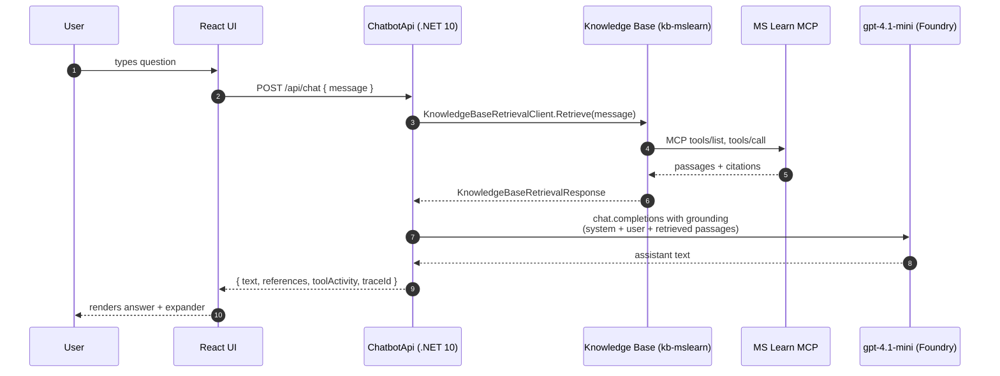

# Architecture

## Components

| Component | Tech | Responsibility |
| --- | --- | --- |
| `frontend/` | Vite + React + TypeScript + Fluent UI | Chat UI, eval panel, tool-activity expander |
| `backend/ChatbotApi` | .NET 10 minimal API | `/api/chat`, `/api/health`, `/api/eval/run`; OTel → App Insights |
| `infra/Demo1.Infra` | .NET 10 console | Idempotent provisioning of Search + KB; never deploys app code |
| `hosted-agent/HostedAgent` | .NET 10 hosted agent | Same orchestration as backend service, packaged for `azd deploy` |
| Azure AI Search | Provisioned by `ensure-search` | Hosts the Knowledge Base + Knowledge Source |
| MS Learn MCP server | Hosted by Microsoft (public) | The actual source of grounding |
| Application Insights | Existing on the project | Receives OTel spans |

## Request sequence (chat)

## Design rationale

### Why orchestrate KB + chat in the backend (not a declarative agent)?

The shipping Azure SDK (`Azure.AI.Projects.Agents` 2.1.0-beta.3) does not yet expose a strongly typed `KnowledgeBaseTool` that we can attach to a `DeclarativeAgentDefinition`. We could hand-roll the tool JSON via `BinaryData`, but the resulting agent is harder to evaluate (no clean tool-call surface for the eval panel) and harder to test (cannot mock the agent's internal tool dispatch). Backend orchestration:

1. Gives the demo the verbatim flow the user asked for: *chatbot calls the KB which calls MCP*.
2. Is fully unit-testable — both steps have public mockable clients.
3. Produces a predictable `toolActivity` payload for the UI.
4. Ports trivially to the Hosted Agent: the same `IChatService.AnswerAsync` runs in either process.

### Knowledge base shape

- One `McpServerKnowledgeSource` named `ks-mslearn-mcp` → `https://learn.microsoft.com/api/mcp`, no auth (public).
- One `KnowledgeBase` named `kb-mslearn` with the source above and one `KnowledgeBaseAzureOpenAIModel` pointing at the project's `gpt-4.1-mini` deployment (used by the KB for query planning).

### Telemetry

`AppContext.SetSwitch("Azure.Experimental.EnableGenAITracing", true)` + `Azure.Experimental.TraceGenAIMessageContent=true` are set before host build. `AddOpenTelemetry().UseAzureMonitor(...)` wires the Azure SDK sources, and the chat endpoint adds an `Activity` for the orchestration so the trace shows: `POST /api/chat → KB.Retrieve → chat.completion`.

### Hosted Agent (Phase 9)

The same orchestration lives in `hosted-agent/HostedAgent/Program.cs`, packaged as a Foundry Hosted Agent and pushed with `azd deploy`. The backend can switch to the hosted agent by setting `HOSTED_AGENT_NAME` and calling the project's Responses API instead of orchestrating locally.
