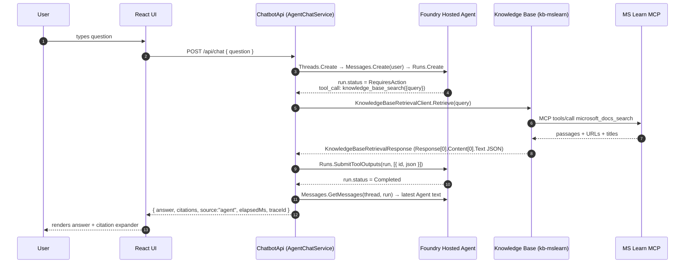
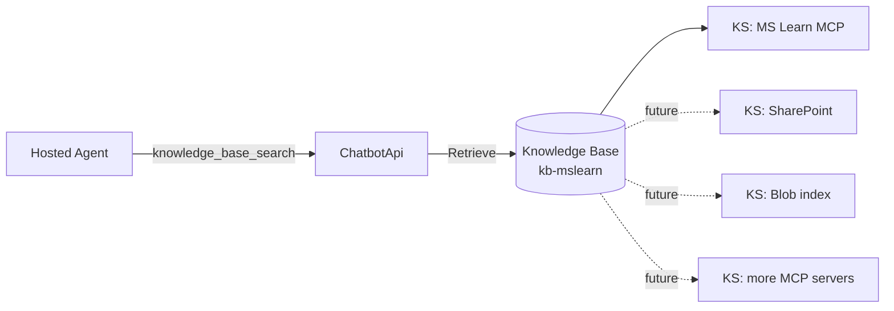
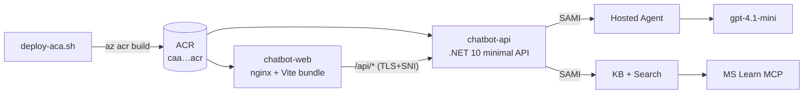

# Architecture

## Components

| Component | Tech | Responsibility |
| --- | --- | --- |
| `frontend/` | Vite + React + TypeScript + Fluent UI | Chat UI, eval panel, tool-activity expander |
| `backend/ChatbotApi` | .NET 10 minimal API | `/api/chat`, `/api/health`, `/api/eval/run`; OTel → App Insights |
| `infra/Demo1.Infra` | .NET 10 console | Idempotent provisioning of Search + KB + hosted agent |
| Foundry Hosted Agent | `Azure.AI.Agents.Persistent` | Portal-visible orchestrator (`kb-mslearn-hosted`); owns the system prompt and citation contract |
| Azure AI Search | Provisioned by `ensure-search` | Hosts the Knowledge Base + Knowledge Source(s) |
| MS Learn MCP server | Hosted by Microsoft (public) | Currently the single grounding source the KB owns |
| Application Insights | Existing on the project | Receives OTel spans for the chat run |

## Request sequence (hosted-agent path, default)



## Design rationale

### Why a Foundry Hosted Agent, not in-process chat completions?

The user wants the hosted agent to *own* the chat. That means: the system prompt, the citation contract, the “only answer from references” guardrail, model+temperature, and the audit trail (thread + run) all live in Foundry. Operators can inspect, version, and re-prompt the agent from the portal without redeploying the backend.

What the **backend** owns is exactly one thing: executing the agent's `knowledge_base_search` tool by calling the Knowledge Base. The agent has no direct line to the KB SDK — it asks the backend, and the backend authenticates as its own SAMI.

### Why a function tool and not the SDK's `KnowledgeBaseToolDefinition`?

`Azure.AI.Agents.Persistent` 1.2.0-beta.8 ships a partial `KnowledgeBaseToolDefinition` type but its server-side routing is not yet enabled for our project's region/SKU. We register a single `FunctionToolDefinition` named `knowledge_base_search` with a JSON Schema (`{ query: string }`) and execute it ourselves. The agent's instructions explicitly say: *“call `knowledge_base_search` with a focused query, then answer using ONLY those references, citing each fact with [n].”* This keeps the contract identical to what a native KB tool would expose, so swapping in the typed tool later is a one-class change.

### Knowledge base shape — and why the KB matters

The KB is the long-lived integration layer. It currently holds **one** knowledge source (`ks-mslearn-mcp` → MS Learn MCP), but the same KB will host more sources later — internal SharePoint, blob containers, additional MCP servers — without any backend change. The agent always asks one tool (`knowledge_base_search`); the KB fans out to whichever sources are configured.



### KB endpoint pitfall (root cause of the 401)

The KB's `AzureOpenAIVectorizerParameters.ResourceUri` **must** be the OpenAI host:

```
https://<account>.openai.azure.com/
```

…not `https://<account>.cognitiveservices.azure.com/`. Our Foundry account has `disableLocalAuth=true`, and the cognitive-services host returns `401 Principal does not have access to API/Operation` for the KB's managed-identity bearer because that token's audience does not match. The infra command `ensure-kb` writes the correct host now; this is documented in [docs/operations.md](docs/operations.md) under *KB 401 (sticky)*.

### Citation extraction shape

`KnowledgeBaseRetrievalResponse.References` is a metadata list (just `ref_id` + tool name). The actual passages live in `Response[0].Content[0].Text` as a JSON array `[{ toolName, ref_id, title, content }, …]`, where each entry's `content` is itself a JSON string `{ title, content, contentUrl }`. The shared [backend/ChatbotApi/KbCitationParser.cs](backend/ChatbotApi/KbCitationParser.cs) parses both layers and produces `Citation { Title, Url, Snippet }` records.

### Legacy in-process path (still available)

Setting `Demo1__UseHostedAgent=false` falls back to `ChatService` (KB-then-LLM in-process). It is kept for two reasons: (1) the eval panel exercises the same `IChatService` interface and was originally written against the in-process implementation; (2) it is a useful baseline when diagnosing agent-side issues. The in-process path is **not** the production flow.

### Telemetry

`AppContext.SetSwitch("Azure.Experimental.EnableGenAITracing", true)` + `Azure.Experimental.TraceGenAIMessageContent=true` are set before host build. `AddOpenTelemetry().UseAzureMonitor(...)` wires the Azure SDK sources. `AgentChatService` adds its own `Activity` spans: `agent.answer` (root), `agent.tool.kb_retrieve` (per tool call). The trace contains the thread id, run id, and KB citation count; the response body returns the `traceId` so it can be pasted into the App Insights query.

### Deploying to Azure Container Apps

`deploy/deploy-aca.sh` is a one-command deploy that stands the same two processes up in Azure Container Apps:



Key decisions:

- **Standard env, not Express.** ACA Express preview lists *Managed identity (app runtime)* as *In development*; the backend needs a system-assigned MI to call Foundry and Search, so we deploy into a standard managed environment. The script supports `ENV_MODE=express` for the future but defaults to `standard`.
- **`az acr build` + `az containerapp create/update` instead of `az containerapp up`.** The `containerapp` CLI extension currently raises `'NoneType' object has no attribute 'linux'` on `up --source` (regression in 1.3.0b4); the explicit build+create path sidesteps it.
- **Two apps, one ingress each.** The frontend has external ingress; it proxies `/api/*` to the backend's external ingress over HTTPS. We considered internal ingress for the backend but kept it external so the demo can `curl` either endpoint.
- **nginx → HTTPS upstream needs SNI.** ACA's ingress (fronted by Azure Front Door) **requires SNI** on the TLS handshake. nginx, by default, sends the upstream IP as the SNI and Host, which gets the handshake reset. `frontend/nginx.conf.template` sets `proxy_ssl_server_name on`, `proxy_ssl_name $backend_host`, and `Host $backend_host`, where `$backend_host` is supplied as the `BACKEND_HOST` env var. Both are substituted at container start by nginx's stock envsubst entrypoint.
- **RBAC for the agent path.** Beyond `Cognitive Services OpenAI User` on the Foundry account, the backend SAMI gets `Azure AI Developer` on the project (to create threads/runs) and `Search Index Data Reader` + `Search Service Contributor` on the Search service (to call `Retrieve` on the KB). The deploy script assigns all of them.

