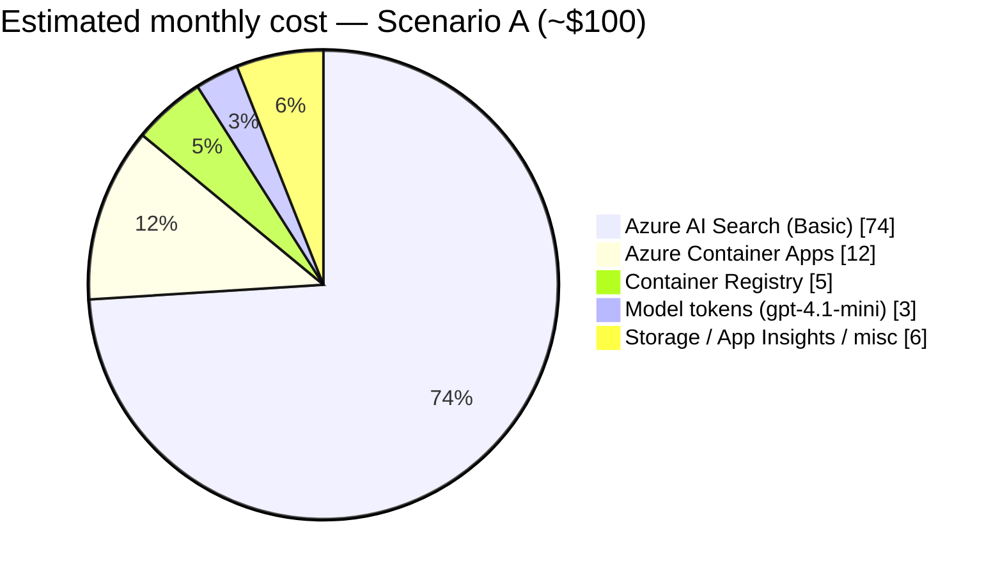

# Cost Estimate

This page estimates the **monthly cost of running this entire solution** on Azure —
the Container Apps frontend, the Foundry hosted agent, the model, the Azure AI
Search knowledge base, and the supporting services.

> **How to read this page.** Every line is tagged:
> **[Published]** = a public list price from the Azure pricing pages;
> **[Estimated]** = derived from this solution's actual configuration and assumed
> usage; **[Unpublished → estimated]** = no firm public unit price, so a reasoned
> estimate is given and flagged. All figures are **USD, pay-as-you-go list prices,
> excluding taxes, discounts, reservations, and free-trial credits**. Prices vary
> by region and change over time.
>
> **Pricing snapshot:** 2026-06-17 · regions **West US / West Central US** · USD.
> Treat the totals as a planning estimate, not a quote — confirm with the
> [Azure Pricing Calculator](https://azure.microsoft.com/pricing/calculator/).

---

## Summary

Two scenarios, same architecture — only the traffic differs:

| Scenario | Assumed usage | Estimated monthly total |
| --- | --- | --- |
| **A — Idle / low-traffic demo** | ~500 chat turns/month, 1 always-on replica | **≈ $95 – $110** |
| **B — Active demo** | ~5,000 chat turns/month | **≈ $120 – $150** |

The cost is **dominated by one fixed line item: Azure AI Search (Basic) at
~$74/month.** Almost everything else is small or usage-based. See
[ways to reduce cost](#ways-to-reduce-cost) below.

---

## Component-by-component breakdown

### 1. Azure AI Search — the knowledge base  ·  ~$74/mo  **[Published]**

The `kb-mslearn` knowledge base runs on an Azure AI Search service at the **Basic**
tier (1 replica, 1 partition).

- **Basic tier:** ~**$0.101/hour ≈ $73.73/month** fixed, billed while the service
  exists (it does not scale to zero). **[Published]**
- **Semantic reranker** (used by knowledge-base / agentic retrieval): **free for
  the first 1,000 queries/month**, then **$1.00 per 1,000 queries** on the Standard
  meter. **[Published]**
  - Scenario A (~500 retrievals): **$0** (within free grant).
  - Scenario B (~5,000 retrievals): ~**$4** (4,000 billable × $1/1,000). **[Estimated]**

> Reference: [Azure AI Search pricing](https://azure.microsoft.com/pricing/details/search/).

### 2. Azure Container Apps — the frontend  ·  ~$10–15/mo  **[Estimated]**

The `chatbot-web` app runs on the **Consumption** workload profile (no fixed
environment fee). It hosts two containers — `nginx` (0.25 vCPU / 0.5 GiB) and the
`token-proxy` sidecar (0.25 vCPU / 0.5 GiB) — with **minReplicas = 1**, so
**0.5 vCPU + 1 GiB is always allocated**.

- **Free monthly grant:** 180,000 vCPU-seconds, 360,000 GiB-seconds, 2M requests.
  **[Published]**
- **Active rates:** ~$0.000024/vCPU-s, ~$0.0000030/GiB-s, $0.40 per million
  requests. **Idle vCPU** is billed at a reduced rate (~$0.0000030/vCPU-s).
  **[Published]**
- **Always-on cost (this config):** ~1.31M vCPU-s and ~2.63M GiB-s per month. After
  the free grants, the memory component dominates at **≈ $7/month**, plus a few
  dollars of (mostly idle) vCPU. Request charges are negligible at demo volume.
  → **≈ $10–15/month total.** **[Estimated]**

> Reference: [Azure Container Apps pricing](https://azure.microsoft.com/pricing/details/container-apps/).

### 3. Azure Container Registry — image storage  ·  ~$5/mo  **[Published]**

The `Basic` registry that stores the `chatbot-web` and `token-proxy` images.

- **Basic:** ~**$0.167/day ≈ $5/month**, includes 10 GB storage and bundled ACR
  Tasks build minutes (used by the deploy script's `az acr build`). **[Published]**

> Reference: [Azure Container Registry pricing](https://azure.microsoft.com/pricing/details/container-registry/).

### 4. Model inference — gpt-4.1-mini  ·  ~$3–25/mo  **[Estimated]**

The agent's model deployment is **gpt-4.1-mini**, billed per token (input + output),
covering both the agent's answer and the knowledge base's query-planning step.

- **List price:** ~**$0.40 per 1M input tokens**, ~**$1.60 per 1M output tokens**
  (cached input ~$0.10 per 1M). **[Published]**
- **Per chat turn (this solution):** a grounded turn sends the system prompt plus
  the retrieved passages — roughly **6,000–9,000 input tokens** and **~600–1,500
  output tokens** — for **≈ $0.005 per turn**. **[Estimated]**
  - Scenario A (~500 turns): **≈ $3/month.**
  - Scenario B (~5,000 turns): **≈ $25/month.**

> Reference: [Azure OpenAI / Foundry models pricing](https://azure.microsoft.com/pricing/details/cognitive-services/openai-service/).

### 5. Foundry Agent Service — hosted agent  ·  mostly token cost  **[Unpublished → estimated]**

The agent itself runs in **Foundry Agent Service** as a hosted agent. The
**primary** charge is the model token usage already counted in item 4; the agent
orchestration layer does not have a separately published per-agent runtime price
for this configuration.

- **Estimate:** assume **$0–5/month** of incidental hosting/orchestration overhead
  beyond tokens for a low-traffic demo. **[Unpublished → estimated — confirm on
  your invoice.]**

> Reference: [Azure AI Foundry Agent Service pricing](https://azure.microsoft.com/pricing/details/ai-foundry/).

### 6. Microsoft Learn MCP source  ·  $0  **[Published]**

The `ks-mslearn-mcp` knowledge source calls the **public Microsoft Learn MCP
server**, which is **free** to use. No Azure charge accrues for this source beyond
the search/reranker costs already counted in item 1.

### 7. Monitoring — Application Insights / Log Analytics  ·  ~$0–3/mo  **[Published]**

Frontend telemetry flows to `appi-demo1` (workspace-based Application Insights).

- **Pay-as-you-go ingestion:** ~**$2.30 per GB**, with the **first 5 GB/month free**.
  **[Published]**
- A demo typically ingests well under 5 GB → **≈ $0**, rising to **~$2–3** if you
  enable verbose tracing. **[Estimated]**

> Reference: [Azure Monitor pricing](https://azure.microsoft.com/pricing/details/monitor/).

### 8. Storage & bandwidth  ·  ~$0–2/mo  **[Estimated]**

- **Blob storage** for the ingested Nasuni PDFs / search index source and any agent
  thread state — a few hundred MB at ~$0.018–0.02/GB-month → **< $1/month**.
  **[Estimated]**
- **Egress bandwidth:** the first 100 GB/month is free under the current model;
  demo traffic is negligible → **≈ $0**. **[Estimated]**

> Reference: [Azure Blob Storage pricing](https://azure.microsoft.com/pricing/details/storage/blobs/) ·
> [Bandwidth pricing](https://azure.microsoft.com/pricing/details/bandwidth/).

---

## Totals

| Component | Scenario A (~500 turns) | Scenario B (~5,000 turns) | Basis |
| --- | --- | --- | --- |
| Azure AI Search (Basic) | $74 | $74 | [Published] |
| └ Semantic reranker | $0 | ~$4 | [Published] |
| Azure Container Apps | ~$12 | ~$15 | [Estimated] |
| Azure Container Registry | $5 | $5 | [Published] |
| Model tokens (gpt-4.1-mini) | ~$3 | ~$25 | [Estimated] |
| Foundry hosted agent overhead | ~$0–5 | ~$0–5 | [Unpublished → estimated] |
| Microsoft Learn MCP | $0 | $0 | [Published] |
| App Insights / Log Analytics | ~$0 | ~$2 | [Published] |
| Storage & bandwidth | ~$1 | ~$2 | [Estimated] |
| **Estimated total** | **≈ $95 – $110** | **≈ $120 – $150** | |

---

## Ways to reduce cost

- **Azure AI Search is ~75% of the bill.** For a pure demo you can run search on
  the **Free tier ($0)** — but it has no SLA, limited storage/indexes, and **does
  not include the semantic reranker** the knowledge base relies on, so retrieval
  quality drops. Basic is the realistic floor for this experience.
- **Scale the frontend to zero.** Setting `minReplicas: 0` lets Container Apps idle
  to **$0 compute** between requests (at the cost of cold-start latency on the first
  request). This solution pins `minReplicas: 1` for snappy demos.
- **Cache or shrink grounding.** Fewer/shorter retrieved passages and using the
  cached-input token rate reduce per-turn model cost.
- **Share infrastructure.** The search service, registry, and monitoring can be
  shared across several demos/agents, amortizing their fixed costs.
- **Use commitments.** Reservations / savings plans and Azure commitment discounts
  can cut the fixed-tier line items (Search, ACR) meaningfully versus list price.

---

## Caveats

- Prices are **list / pay-as-you-go** and **exclude** taxes, EA/CSP/MACC discounts,
  reservations, and free Azure credits.
- **Regional variation:** the figures use West US / West Central US; other regions
  differ.
- The **Foundry hosted-agent** overhead and exact **semantic-retrieval token
  accounting** are the least-certain lines — verify against your actual Azure
  invoice and **[Microsoft Cost Management](https://learn.microsoft.com/azure/cost-management-billing/)**.
- Usage assumptions (500 vs 5,000 turns, token sizes) are illustrative; your real
  cost scales with traffic and answer length.
