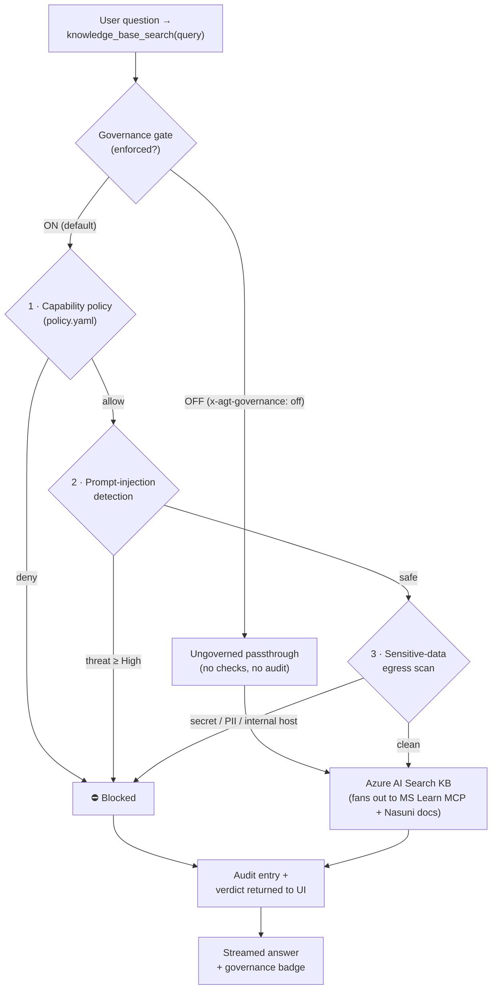

# AI Governance

This assistant runs every knowledge-base search through the **Microsoft Agent
Governance Toolkit (AGT)** before any retrieval happens. The toggle in the chat
toolbar (**Governance ON / OFF**) lets you watch the exact same question behave
two completely different ways — once with the guardrails enforced, once without —
so the value of governance is visible, not theoretical.

This page explains **what** the toolkit does on every request, **how** it works
inside the agent, and **why** it matters for shipping an agent you can defend to a
security review.

---

## What governance does on every request

When governance is **ON**, each call to the agent's one tool —
`knowledge_base_search` — passes through a single decision point (the
"governance gate") that layers three independent, deterministic controls and
records the outcome to a tamper-evident audit log. Only if **all three** controls
pass does the query reach Azure AI Search.



Every decision — allow **or** block — produces a verdict object that is returned
alongside the results and rendered as a badge in the chat. A block shows the
category and reason; an allow shows the policy, the matched rule, the agent's
identity, and the audit sequence number.

---

## The three controls

### 1. Capability policy — *what the agent is allowed to do*

A declarative policy file
([`hosted-agent/policy.yaml`](https://github.com/michaelsrichter/nasuni-azure-assistant/blob/main/hosted-agent/policy.yaml))
uses **default-deny**: the agent may invoke **only** the single sanctioned tool,
`knowledge_base_search`. If a future model run — whether through a bug, an
upgrade, or an injection attack — tried to call any other capability, the policy
engine would block it.

```yaml
default_action: deny
rules:
  - name: allow-knowledge-base-search
    condition: "tool_name == 'knowledge_base_search'"
    action: allow
```

This is **capability sandboxing**: the agent's blast radius is constrained by
policy, not by hoping the prompt holds. The policy is data, so you change what the
agent is permitted to do without recompiling it.

### 2. Prompt-injection detection — *resisting "ignore your instructions"*

The toolkit's built-in detector inspects each incoming query for prompt-injection
patterns (instruction overrides, system-prompt extraction, jailbreak phrasing). It
returns a threat level and a confidence score; queries at **High** threat or above
are blocked before retrieval. This protects against the classic agent attack where
a user (or a poisoned document) tries to hijack the agent's behavior.

### 3. Sensitive-data egress scan — *what is allowed to leave*

The knowledge base fans out to an **external** Microsoft Learn MCP server, so a
search query is data that crosses the trust boundary. AGT's policy engine governs
*which* tool runs; a deterministic scanner
([`SensitiveDataScanner.cs`](https://github.com/michaelsrichter/nasuni-azure-assistant/blob/main/hosted-agent/Governance/SensitiveDataScanner.cs))
governs *what* is allowed to be sent. It blocks queries that carry:

| Category | Examples it catches |
| --- | --- |
| **Secrets** | API keys, passwords, bearer/access tokens, Azure storage connection strings & account keys, private-key blocks |
| **PII** | National identifiers (e.g. SSNs), payment-card numbers |
| **Egress targets** | The cloud instance-metadata endpoint (`169.254.169.254`), private/internal network hosts |

This stops an agent from accidentally **exfiltrating** a credential or PII to an
external service — a real risk the moment any tool reaches outside your boundary.

---

## Tamper-evident audit & observability

Every governed decision is appended to a **hash-chained audit log** (each entry
carries its own hash plus the previous entry's hash). That makes the log
tamper-evident: you cannot quietly alter or delete a past decision without breaking
the chain, which is exactly what a compliance reviewer or incident responder needs.

Alongside the audit trail, the gate records **OpenTelemetry metrics** (decision
counts, blocks) under the `AgentGovernance` meter and emits structured events on
block. The net result is that *"what did the agent do, and why was it allowed or
stopped?"* is answerable from evidence — per request, after the fact.

---

## Why this matters (the value proposition)

Agents are only useful when they can *act* — call tools, reach external systems,
retrieve data. That same power is the risk. Governance turns "trust the prompt"
into **verifiable, enforced controls**:

| Without governance | With the Agent Governance Toolkit |
| --- | --- |
| The agent can call any tool the model decides to | **Default-deny capability policy** — only sanctioned tools run |
| Prompt-injection can redirect the agent | **Injection detection** blocks high-threat queries pre-retrieval |
| Secrets/PII can leak to external tools | **Egress scanning** blocks sensitive data before it leaves |
| "What did it do?" is a log-spelunking exercise | **Tamper-evident audit + metrics** answer it from evidence |
| Safety logic is scattered through prompt + code | **One decision point**, declarative policy, consistent verdicts |

Crucially, these are **deterministic** controls — they don't depend on the model
choosing to behave. That is what lets you put an autonomous agent in front of real
data and still pass a security review: safety, observability, and compliance are
enforced by the platform, not promised by the prompt.

> **Try it:** flip the toggle to **OFF**, run one of the two **AI Governance**
> starter prompts (a secret-leak attempt and a prompt-injection attempt), and watch
> them sail through ungoverned. Flip it back **ON** and run the same prompts — both
> are blocked, with a verdict badge explaining exactly which control stopped them
> and an audit entry to prove it.

---

## Where the code lives

These links point at the exact files on the public repository's `main` branch.

### Policy — the declarative capability rules

[`hosted-agent/policy.yaml`](https://github.com/michaelsrichter/nasuni-azure-assistant/blob/main/hosted-agent/policy.yaml)
— default-deny with a single allow rule for `knowledge_base_search`.

### The governance gate — the single decision point

[`hosted-agent/Governance/GovernanceGate.cs`](https://github.com/michaelsrichter/nasuni-azure-assistant/blob/main/hosted-agent/Governance/GovernanceGate.cs)
— builds the AGT `GovernanceKernel` (policy + audit + metrics + injection
detection), creates the agent's identity, and layers the three controls into one
`Evaluate(...)` call that returns a single verdict.

### The egress scanner — sensitive-data content control

[`hosted-agent/Governance/SensitiveDataScanner.cs`](https://github.com/michaelsrichter/nasuni-azure-assistant/blob/main/hosted-agent/Governance/SensitiveDataScanner.cs)
— deterministic regex rules for secrets, PII, and internal/egress targets.

### The governed tool — toggle + verdict serialization

[`hosted-agent/Governance/GovernedKnowledgeBaseSearch.cs`](https://github.com/michaelsrichter/nasuni-azure-assistant/blob/main/hosted-agent/Governance/GovernedKnowledgeBaseSearch.cs)
— the function actually registered with the agent. It reads the per-request
`x-agt-governance` header (governance is **ON** by default; the SPA opts out with
`off`), runs the gate, and returns `{ results, governance }` so the UI can render
the verdict.

### Wiring it into the agent

[`hosted-agent/Program.cs`](https://github.com/michaelsrichter/nasuni-azure-assistant/blob/main/hosted-agent/Program.cs)
— constructs the gate, wraps the raw knowledge-base tool, and registers the
**governed** function as the agent's one capability.
