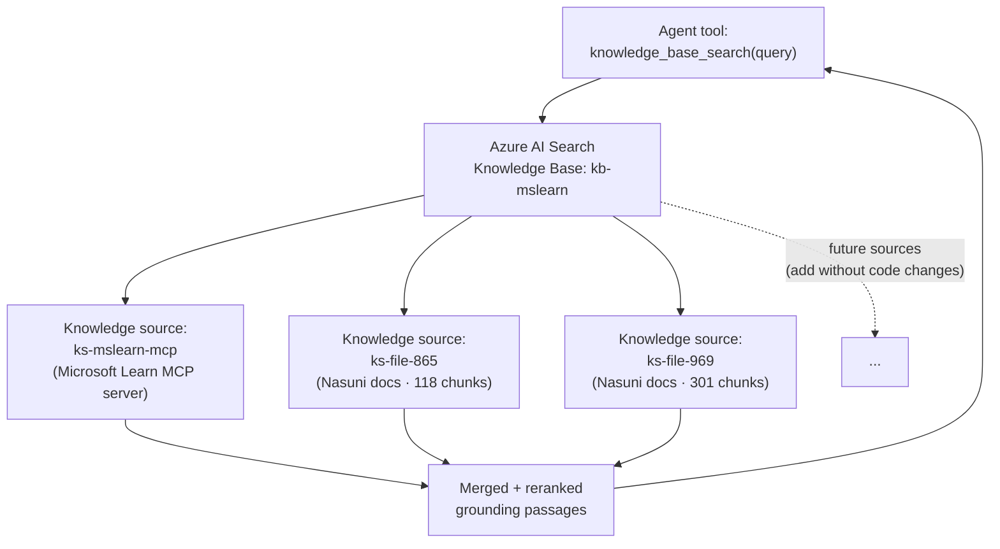
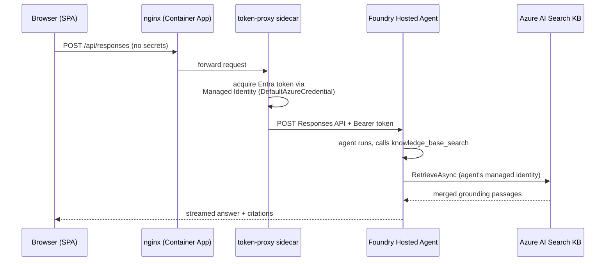
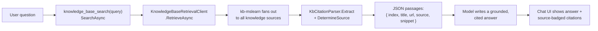

# Knowledge Base

This assistant never answers from the model's own memory. Every fact it states is
pulled, at request time, from a single **Azure AI Search Knowledge Base** named
`kb-mslearn`. That one knowledge base quietly fans out to several underlying data
sources on the agent's behalf — and that indirection is the whole point.

This page explains what the knowledge base gives us, why it dramatically
simplifies building and grounding the agent, how authentication and authorization
work end-to-end, and exactly where in the code we connect to it (with links to the
specific lines on GitHub).

---

## One knowledge base, many sources

The agent is wired to **exactly one** retrieval endpoint. Behind that endpoint,
the knowledge base orchestrates three independent **knowledge sources**:

- **`ks-mslearn-mcp`** — a live **Model Context Protocol (MCP)** connection to the
  Microsoft Learn documentation server. The knowledge base calls it on demand; we
  never crawl or copy Microsoft's docs.
- **`ks-file-865`** and **`ks-file-969`** — the Nasuni-on-Azure PDF documentation,
  ingested and vectorized into Azure AI Search indexes for hybrid (vector +
  keyword) retrieval.

When the agent calls `knowledge_base_search`, the knowledge base queries **all
three** sources, ranks the combined results with its semantic reranker, and
returns one merged set of passages. The agent code does not know or care how many
sources there are.

---

## Why this simplifies building and managing the agent

Without a knowledge base, the agent would have to own all of this itself:

| Concern | Without a KB (DIY) | With `kb-mslearn` |
| --- | --- | --- |
| **Connecting sources** | Write + maintain a client for each source (MCP client, search client per index, custom merge code) | Attach sources to one KB; the agent calls **one** method |
| **Query fan-out** | Hand-roll parallel calls and timeouts to every source | The KB fans out and aggregates for you |
| **Ranking / merging** | Build your own cross-source reranking | Built-in semantic reranking across sources |
| **Adding a source** | Ship new agent code + redeploy | Attach the source to the KB — **no agent code change** |
| **Grounding format** | Normalize each source's shape yourself | Uniform passages with a consistent reference shape |

The net effect: the agent's retrieval surface is a **single tool with a single
query parameter**. Adding the two Nasuni document sources to this demo required
**zero changes** to the agent's compiled code — they were attached to the KB and
immediately started showing up in answers (and in the citation badges in chat).

This is the key architectural win: **the knowledge base is the integration point,
not the agent.** You evolve your grounding data by managing the KB, while the agent
stays a thin, stable pass-through.

---

## How authentication & authorization work

There are no API keys or connection strings to the knowledge base anywhere in the
shipped code. The entire path uses **Microsoft Entra ID** identities and
**Azure RBAC**.

1. **Browser → app:** The SPA holds **no secrets**. It just POSTs the user's
   question to its own origin (`/api/responses`).
2. **token-proxy sidecar → Foundry:** A small Node sidecar uses the Container
   App's **system-assigned managed identity** to mint a short-lived Entra access
   token (scope `https://ai.azure.com/.default`) and attaches it as a Bearer token
   when calling the Foundry agent's Responses endpoint. No client secret is ever
   stored.
3. **Agent → knowledge base:** Inside Foundry, the agent authenticates to Azure AI
   Search with `DefaultAzureCredential` (a managed identity) — see
   [`Program.cs` line 21](https://github.com/michaelsrichter/nasuni-azure-assistant/blob/main/hosted-agent/Program.cs#L21).
   No search admin key is embedded in the agent.
4. **RBAC, not keys:** Access is granted by **role assignments**, not shared
   secrets. The deploy script grants the frontend identity the Foundry
   *Agent Consumer* and *Project Runtime User* roles, and the agent's identity has
   data-plane read access to the search service. Revoking access is a role removal,
   and tokens are short-lived and auto-rotated.

### Security posture in general

- **No secrets in source or in the browser bundle.** Telemetry and endpoints are
  injected at container start; identity tokens are acquired at runtime.
- **Least-privilege RBAC.** Each identity gets only the roles it needs (consume the
  agent; read from search).
- **Short-lived, auto-rotated tokens** via managed identity — nothing long-lived to
  leak.
- **Server-side retrieval only.** The browser can never query the knowledge base
  directly; it can only ask the agent, which decides what to retrieve.
- **Grounded answers reduce a different risk class** — hallucination. The agent is
  instructed to use **only** what the KB returns (see the grounding rules below),
  which keeps answers traceable to a citation.

---

## Where the code connects to the knowledge base

All of the integration lives in the hosted agent. These links point at the exact
lines on the public repository's `main` branch.

### 1. Read the KB endpoint + name (no secrets)

[`hosted-agent/Program.cs` L16–L19](https://github.com/michaelsrichter/nasuni-azure-assistant/blob/main/hosted-agent/Program.cs#L16-L19)
— the search endpoint and knowledge-base name come from environment variables
(`DEMO1_SEARCH_ENDPOINT`, `DEMO1_KNOWLEDGE_BASE_NAME`), injected at deploy time.

### 2. Authenticate with a managed identity

[`hosted-agent/Program.cs` L21–L22](https://github.com/michaelsrichter/nasuni-azure-assistant/blob/main/hosted-agent/Program.cs#L21-L22)
— `new DefaultAzureCredential()` is the only credential, and it's passed straight
into the knowledge-base tool. No keys.

### 3. Register the KB as the agent's one retrieval tool

[`hosted-agent/Program.cs` L24–L33](https://github.com/michaelsrichter/nasuni-azure-assistant/blob/main/hosted-agent/Program.cs#L24-L33)
— the agent is created with a single tool, `knowledge_base_search`, exposed to the
model via `AIFunctionFactory.Create`.

### 4. The thin pass-through to Azure AI Search

[`hosted-agent/Tools/KnowledgeBaseSearchTool.cs` L19–L22](https://github.com/michaelsrichter/nasuni-azure-assistant/blob/main/hosted-agent/Tools/KnowledgeBaseSearchTool.cs#L19-L22)
— constructs the `KnowledgeBaseRetrievalClient` from the endpoint, KB name, and
credential. This single client is the whole connection; the KB owns the fan-out to
MCP and the file sources.

[`hosted-agent/Tools/KnowledgeBaseSearchTool.cs` L24–L29](https://github.com/michaelsrichter/nasuni-azure-assistant/blob/main/hosted-agent/Tools/KnowledgeBaseSearchTool.cs#L24-L29)
— the `[Description(...)]` and `SearchAsync(string query)` signature the model
sees. Notice the tool takes **just a query** — no source selection, no index names.

[`hosted-agent/Tools/KnowledgeBaseSearchTool.cs` L39–L40](https://github.com/michaelsrichter/nasuni-azure-assistant/blob/main/hosted-agent/Tools/KnowledgeBaseSearchTool.cs#L39-L40)
— `_kb.RetrieveAsync(...)` performs the actual cross-source retrieval; the result
is handed to the citation parser.

### 5. Label each passage with its real source

[`hosted-agent/Tools/KbCitationParser.cs` L60–L84](https://github.com/michaelsrichter/nasuni-azure-assistant/blob/main/hosted-agent/Tools/KbCitationParser.cs#L60-L84)
— `DetermineSource(...)` inspects each returned chunk (MCP tool name, the
`ks-mslearn-` title prefix, or a `learn.microsoft.com` URL) so the UI can badge a
fact as **📘 Microsoft Learn** or **📄 Nasuni PDF**.

### 6. Keep the model honest (grounding rules)

[`hosted-agent/Instructions.cs` L16–L31](https://github.com/michaelsrichter/nasuni-azure-assistant/blob/main/hosted-agent/Instructions.cs#L16-L31)
— the absolute grounding rules: use **only** what `knowledge_base_search` returns,
never invent facts or citations, and say "I couldn't find that" when the
references don't contain an answer.

---

## How a single turn flows through the code

The model receives a uniform JSON array of `{ index, title, url, source, snippet }`
entries and is required to cite each claim with a bracketed `[n]` that maps to one
of those entries. Because the source label travels with every passage, the chat UI
can show exactly which knowledge source grounded each citation.

---

## Takeaways

- **One KB, many sources.** The agent integrates with a single endpoint; the
  knowledge base handles fan-out, ranking, and merging.
- **Add data, not code.** New knowledge sources (more PDFs, another MCP server,
  a website index) attach to the KB without touching or redeploying the agent.
- **Identity-based security throughout.** Managed identities + Azure RBAC +
  short-lived Entra tokens — no keys in source or in the browser.
- **Grounded by construction.** The agent answers only from retrieved passages and
  cites them, with each citation badged by its true source.
